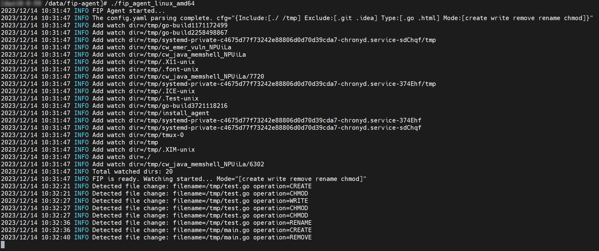
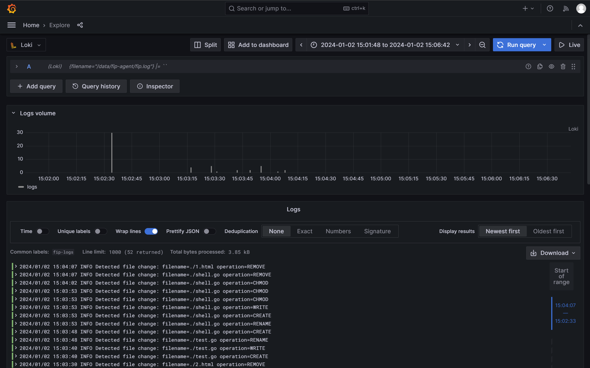

## 项目说明

**FIP（File Integrity Protection）**，文件完整性保护工具，使用 Go 编写。

基于 [fsnotify](https://github.com/fsnotify/fsnotify) 开源项目实现，底层使用了 Inotify 机制 hook 系统调用，能够同时监听多个文件目录变更，可用于文件系统监控、网页防篡改等场景。

特性：跨平台、递归监控、零延迟、系统资源占用低。

## 运行方式

### 二进制文件
#### Linux

1. 下载：`releases/fip_agent_linux_amd64`
2. 修改权限：`chmod +x fip_agent_linux_amd64`
3. 首次使用执行 `./fip_agent_linux_amd64 -g` 生成配置文件
4. 运行：`./fip_agent_linux_amd64`

#### Windows

1. 下载：`releases/fip_agent_windows_amd64.exe`
2. 首次使用执行 `fip_agent_windows_amd64.exe -g` 生成配置文件
3. 运行：`fip_agent_windows_amd64.exe`

### 源码编译

> 编译环境：Go > 1.21

1. 下载：`git clone git@github.com:eW1z4rd/FIP-agent.git && cd FIP-agent`
2. 编译：`go build -o fip-agent main.go`
3. 运行：`./fip-agent`

### 命令行参数

```bash
Usage of fip-agent:
  -c string
        set the config file path (default "./config.yaml")
  -g    generate the config file
  -v    show version info 
  -h    print this help summary page
```

## 配置文件

### 说明

1. `include`、`exclude` 可以配置多个目录，支持相对路径和绝对路径，会递归发现其下所有子目录（不建议监听大范围目录）；
2. 用 `type` 匹配文件后缀类型，忽略其他类型文件的告警，使用 `.*` 监听所有文件；
3. 支持监听 5 种事件：`create`、`write`、`remove`、`rename`、`chmod`；
4. 支持指定放行时间窗口，在该时间范围内的变更操作，可选择不产生告警（`quiet`）或添加放行标签（`tag`）；
5. 支持 Cgroup 内核级资源限制，默认 CPU 使用率不超过 10%，内存占用值不超过 500MB。

### 示例

```yaml
# 监控配置
watch:
  # 包含路径
  # ./          监听当前文件目录及其所有子目录
  # /data/sec   监听/data/sec目录及其所有子目录
  include:
    - ./
    - /tmp

  # 排除路径
  # /data/sec/.git    忽略/data/sec/.git目录及其所有子目录
  exclude:
    - .git
    - .idea

  # 文件类型
  # .*    所有文件
  # .go   后缀为.go的文件
  type:
    #  - .*
    - .go
    - .html

  # 监听模式
  # create  创建文件事件
  # write   写入文件事件
  # remove  删除文件事件
  # rename  重命名文件事件
  # chmod   修改文件权限事件
  mode:
    - create
    - write
    - remove
    - rename
    - chmod

  # 放行时间
  # start  开始时间
  # end    结束时间
  # mode   放行模式（quiet-不产生告警；tag-添加放行标签）
  release:
    start: "00:00:00"
    end: "00:00:00"
    mode: tag

# 资源配置
cgroup:
  # 最大CPU使用率（单位 %）
  max_cpu_usage: 10%
  # 最大内存占用值（可选单位：K、M、G）
  max_memory_usage: 500M
```

## 效果展示



## 可视化方案

使用组件：**Loki + Promtail + Grafana**

1. `promtail-config.yaml` 添加配置项：

   ```yaml
   scrape_configs:
   - job_name: fip
     static_configs:
     - targets:
         - localhost
       labels:
         job: fip-logs
         __path__: /data/fip-agent/fip.log
   ```

2. 运行 fip-agent：`nohup ./fip-agent > ./fip.log 2>&1 &`

3. 访问 Grafana：
